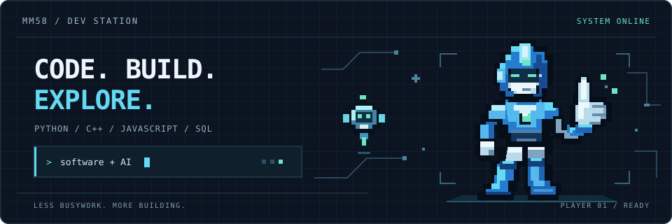

# Well met, dear reader — allow me to introduce myself as MM58. 👋

**Software engineer with 2+ years of experience, building AI-powered tools.**

My main languages are **Python, C++, and JavaScript**, backed by solid **SQL** experience. I also enjoy experimenting with languages that catch my interest.

## What I'm building

### [JAVE](https://github.com/MM58-crypto/J.A.V.E) — less job-search busywork

A job-search assistant with two main workflows:

- **Scout** finds relevant, recently posted jobs based on a user-entered role.
- **Applier / Agent** automates much of the LinkedIn Easy Apply workflow using user-supplied JSON profiles, with user review and approval before submission.

### [poly-mastery](https://github.com/MM58-crypto/poly-mastery) — prove it by building

A university-like platform for building technical competency across domains. Progress comes from observable work and demonstrated understanding—not just completing content.

## Experience beyond the public repos

I've implemented end-to-end **retrieval-augmented generation (RAG)** pipelines across multiple projects, covering:

- **Data preparation:** extensive cleaning, preparation, and ingestion.
- **Retrieval:** retriever models, semantic search, and vector databases.
- **Answering:** reader models and generative models.

Project details aren't public yet.

## What I'm exploring 🔎

- **Data engineering & ETL pipelines** — building on my SQL experience; actively learning this field.
- **Arabic NLP** — exploring machine learning applications for Arabic through a project currently in progress.

## Let's connect

Interested in **software engineering and AI engineering roles**, as well as **data engineering opportunities where I can grow**. Fellow developers: happy to connect over projects and shared interests.

[Email](mailto:mohammed.magdi999@gmail.com) · [Telegram @mm580](https://t.me/mm580)

---

*I use Arch, btw!*
